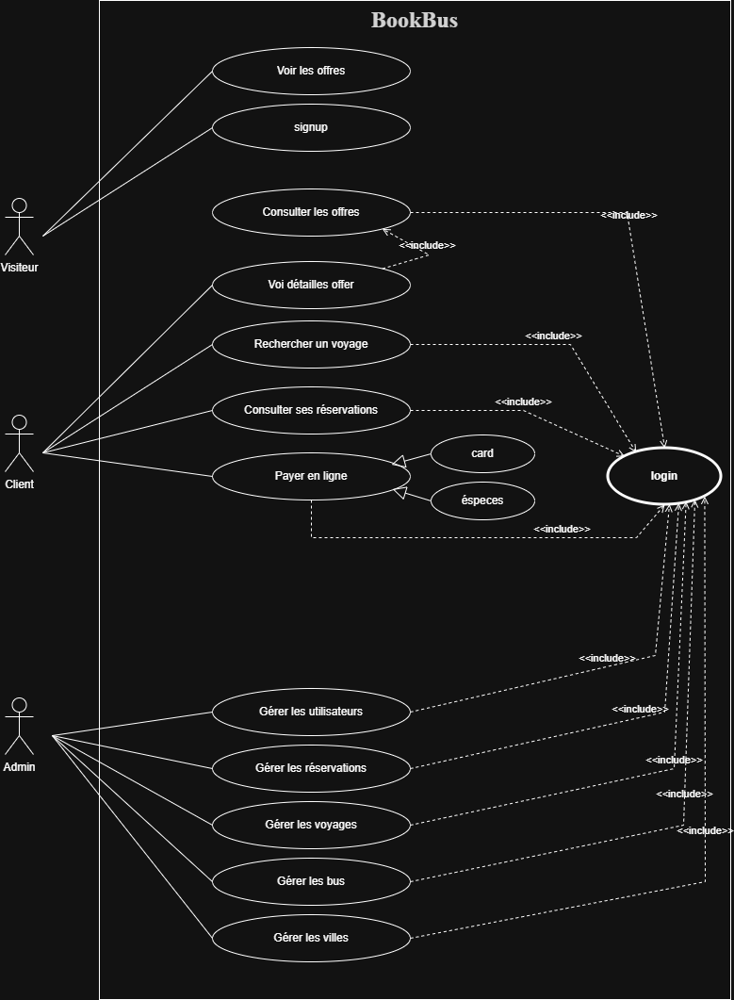

# DOCUMENTATION - BookBus

## 📋 Table des Matières

1. [Analyse du Domaine](#a-analyse-du-domaine)
2. [Proposition d'Architecture](#b-proposition-darchitecture)
3. [Choix Techniques](#c-choix-techniques)

---

## A. Analyse du Domaine

### 1. Étude de marKoub.ma

#### Processus de Réservation (Étapes Utilisateur)

Le processus de réservation sur marKoub.ma suit un flux utilisateur simple et intuitif :

1. **Recherche de Voyage**
   - L'utilisateur sélectionne la ville de départ
   - L'utilisateur sélectionne la ville d'arrivée
   - L'utilisateur choisit la date de voyage
   - Le système affiche tous les voyages disponibles

2. **Sélection du Voyage**
   - L'utilisateur compare les prix des différentes compagnies
   - L'utilisateur consulte les horaires de départ et d'arrivée
   - L'utilisateur vérifie les équipements du bus (WiFi, AC, WC, etc.)
   - L'utilisateur sélectionne le voyage souhaité

3. **Sélection des Sièges**
   - Le système affiche un plan du bus avec les sièges disponibles
   - L'utilisateur sélectionne le(s) siège(s) souhaité(s)
   - Le système calcule le prix total

4. **Informations Passager**
   - L'utilisateur saisit son nom complet
   - L'utilisateur saisit son numéro de téléphone
   - L'utilisateur saisit son email (optionnel)

5. **Paiement**
   - L'utilisateur choisit le mode de paiement (carte bancaire, espèces, mobile money)
   - L'utilisateur effectue le paiement
   - Le système génère une référence de réservation

6. **Confirmation**
   - L'utilisateur reçoit un billet électronique par email/SMS
   - L'utilisateur peut télécharger ou imprimer son billet
   - L'utilisateur peut consulter sa réservation dans son historique

#### Entités Principales Identifiées

| Entité                    | Description                               | Attributs Clés                                         |
| ------------------------- | ----------------------------------------- | ------------------------------------------------------ |
| **Utilisateur**           | Client ou administrateur de la plateforme | id, nom, email, téléphone, rôle                        |
| **Compagnie de Bus**      | Entreprise de transport                   | id, nom, logo, contact, adresse                        |
| **Bus**                   | Véhicule de transport                     | id, immatriculation, modèle, capacité, équipements     |
| **Trajet (Route)**        | Itinéraire entre deux villes              | id, ville_départ, ville_arrivée, distance, durée       |
| **Voyage (Trip)**         | Instance programmée d'un trajet           | id, trajet, bus, horaires, prix, places_disponibles    |
| **Réservation (Booking)** | Réservation effectuée par un client       | id, utilisateur, voyage, référence, statut, prix_total |
| **Siège (Seat)**          | Siège réservé dans un bus                 | id, réservation, numéro_siège, type                    |
| **Paiement (Payment)**    | Transaction financière                    | id, réservation, montant, méthode, statut              |

#### Flux d'Administration Observé

Les administrateurs (compagnies de bus) ont accès à un tableau de bord pour :

1. **Gestion des Bus**
   - Ajouter/modifier/supprimer des bus
   - Définir la capacité et les équipements
   - Gérer les immatriculations

2. **Gestion des Trajets**
   - Créer des trajets entre villes
   - Définir les distances et durées estimées

3. **Programmation des Voyages**
   - Créer des voyages avec horaires précis
   - Définir les tarifs
   - Assigner un bus à un voyage

4. **Suivi des Réservations**
   - Consulter toutes les réservations
   - Voir les statistiques de remplissage
   - Gérer les annulations

5. **Rapports et Statistiques**
   - Chiffre d'affaires par période
   - Taux d'occupation des bus
   - Trajets les plus populaires

---

## B. Proposition d'Architecture

### 1. Schéma de Base de Données (MCD/ERD)

Notre base de données comprend **8 tables principales** avec les relations suivantes :


#### Relations Principales

- **users** (1,n) ↔ (0,n) **bookings** : Un utilisateur peut avoir plusieurs réservations
- **bus_companies** (1,1) ↔ (0,n) **buses** : Une compagnie possède plusieurs bus
- **buses** (1,1) ↔ (0,n) **trips** : Un bus peut effectuer plusieurs voyages
- **routes** (1,1) ↔ (0,n) **trips** : Un trajet peut avoir plusieurs voyages programmés
- **trips** (1,1) ↔ (0,n) **bookings** : Un voyage peut avoir plusieurs réservations
- **bookings** (1,1) ↔ (1,1) **payments** : Une réservation a un paiement unique
- **bookings** (1,1) ↔ (1,n) **seats** : Une réservation peut avoir plusieurs sièges

#### Tables Détaillées

**1. users** - Utilisateurs du système

- `id`, `name`, `email`, `password`, `phone`, `role` (client/admin)
- Index sur `email` et `role`

**2. bus_companies** - Compagnies de transport

- `id`, `name`, `logo`, `phone`, `email`, `address`
- Index sur `name`

**3. buses** - Véhicules

- `id`, `bus_company_id`, `registration_number`, `model`, `total_seats`, `seat_layout` (JSON), `amenities` (JSON)
- Index sur `bus_company_id` et `registration_number`

**4. routes** - Trajets entre villes

- `id`, `departure_city`, `arrival_city`, `distance_km`, `duration_minutes`
- Index composite sur `(departure_city, arrival_city)`

**5. trips** - Voyages programmés

- `id`, `route_id`, `bus_id`, `departure_time`, `arrival_time`, `price`, `status`, `available_seats`
- Index sur `route_id`, `bus_id`, `departure_time`, `status`

**6. bookings** - Réservations

- `id`, `user_id`, `trip_id`, `booking_reference`, `passenger_name`, `passenger_phone`, `number_of_seats`, `total_price`, `status`
- Index sur `user_id`, `trip_id`, `booking_reference`, `status`

**7. payments** - Paiements

- `id`, `booking_id`, `amount`, `payment_method`, `transaction_id`, `status`, `paid_at`
- Index sur `booking_id`, `status`, `transaction_id`

**8. seats** - Sièges réservés

- `id`, `booking_id`, `seat_number`, `seat_type` (standard/vip)
- Index sur `booking_id`

### 2. Diagramme de Cas d'Utilisation



#### Acteurs Identifiés

**1. Visiteur (Non authentifié)**

- Voir les offres disponibles
- Rechercher un voyage
- Consulter les détails d'un voyage

**2. Client (Authentifié)**

- S'inscrire / Se connecter
- Rechercher un voyage
- Consulter ses réservations
- Réserver un billet
- Payer en ligne
- Annuler une réservation

**3. Administrateur (Compagnie de Bus)**

- Gérer les utilisateurs
- Gérer les compagnies de bus
- Gérer les bus
- Gérer les trajets
- Gérer les voyages
- Consulter les réservations
- Consulter les statistiques

### 3. Diagramme de Classes

Les classes principales de notre application :

**1. User**

- Attributs : `id`, `name`, `email`, `password`, `phone`, `role`
- Méthodes : `bookings()`, `isAdmin()`, `isClient()`

**2. BusCompany**

- Attributs : `id`, `name`, `logo`, `phone`, `email`, `address`
- Méthodes : `buses()`, `trips()`, `statistics()`

**3. Bus**

- Attributs : `id`, `registration_number`, `model`, `total_seats`, `amenities`
- Méthodes : `company()`, `trips()`, `isAvailable()`

**4. Route**

- Attributs : `id`, `departure_city`, `arrival_city`, `distance_km`, `duration_minutes`
- Méthodes : `trips()`, `calculateDuration()`

**5. Trip**

- Attributs : `id`, `departure_time`, `arrival_time`, `price`, `status`, `available_seats`
- Méthodes : `route()`, `bus()`, `bookings()`, `hasAvailableSeats()`, `updateAvailableSeats()`

**6. Booking**

- Attributs : `id`, `booking_reference`, `passenger_name`, `number_of_seats`, `total_price`, `status`
- Méthodes : `user()`, `trip()`, `payment()`, `seats()`, `cancel()`, `confirm()`

**7. Payment**

- Attributs : `id`, `amount`, `payment_method`, `transaction_id`, `status`, `paid_at`
- Méthodes : `booking()`, `process()`, `refund()`

**8. Seat**

- Attributs : `id`, `seat_number`, `seat_type`
- Méthodes : `booking()`, `isVIP()`

### 4. Fonctionnalités MVP (Minimum Viable Product)

#### Phase 1 - Fonctionnalités Essentielles

**Pour les Clients :**

- ✅ Inscription et connexion
- ✅ Recherche de voyages (ville départ, ville arrivée, date)
- ✅ Affichage des résultats avec filtres (prix, horaire, compagnie)
- ✅ Réservation de billets
- ✅ Paiement en ligne (simulation)
- ✅ Consultation de l'historique des réservations

**Pour les Administrateurs :**

- ✅ Authentification admin
- ✅ Gestion des compagnies de bus (CRUD)
- ✅ Gestion des bus (CRUD)
- ✅ Gestion des trajets (CRUD)
- ✅ Programmation des voyages (CRUD)
- ✅ Consultation des réservations
- ✅ Tableau de bord avec statistiques de base

#### Phase 2 - Fonctionnalités Avancées (Futures)

- Sélection interactive des sièges (plan du bus)
- Notifications par email/SMS
- Système de remboursement
- Gestion des promotions et codes promo
- Système de fidélité
- API mobile
- Paiement multi-devises
- Intégration avec des passerelles de paiement réelles

---

## C. Choix Techniques

### 1. Justification du Choix de Laravel

Laravel a été choisi pour ce projet pour les raisons suivantes :

#### **a) Architecture MVC Robuste**

- Séparation claire entre la logique métier, la présentation et les données
- Facilite la maintenance et l'évolutivité du code
- Idéal pour une application de réservation complexe

#### **b) Eloquent ORM**

- Gestion élégante des relations entre entités (users, bookings, trips, etc.)
- Requêtes fluides et lisibles
- Migrations pour versionner la base de données
- Parfait pour notre modèle relationnel complexe (8 tables avec multiples relations)

#### **c) Système d'Authentification Intégré**

- Laravel Breeze/Sanctum pour l'authentification
- Gestion des rôles (client/admin) simplifiée
- Sécurité renforcée (hashing de mots de passe, CSRF protection)

#### **d) Blade Template Engine**

- Syntaxe simple et intuitive
- Réutilisation de composants (layouts, partials)
- Parfait pour créer une interface utilisateur cohérente

#### **e) Écosystème Riche**

- Packages Laravel pour paiements (Cashier, Stripe)
- Notifications (email, SMS)
- File d'attente pour les tâches asynchrones
- Scheduler pour les tâches planifiées

#### **f) Performance et Scalabilité**

- Cache intégré (Redis, Memcached)
- Queue system pour les opérations lourdes
- Optimisation des requêtes avec Eager Loading
- Prêt pour une croissance future

#### **g) Documentation et Communauté**

- Documentation exhaustive en français et anglais
- Grande communauté active
- Nombreux tutoriels et ressources
- Support à long terme (LTS)

#### **h) Sécurité**

- Protection CSRF native
- Validation des données robuste
- Protection contre les injections SQL
- Hashing sécurisé des mots de passe

### 2. Dépendances PHP/Laravel Nécessaires

#### **Dépendances de Base**

```json
{
  "require": {
    "php": "^8.2",
    "laravel/framework": "^12.0",
    "laravel/breeze": "^2.0",
    "laravel/sanctum": "^4.0",
    "laravel/tinker": "^2.9"
  }
}
```

#### **Dépendances pour le Développement**

```json
{
  "require-dev": {
    "fakerphp/faker": "^1.23",
    "laravel/pint": "^1.13",
    "laravel/sail": "^1.26",
    "mockery/mockery": "^1.6",
    "nunomaduro/collision": "^8.0",
    "phpunit/phpunit": "^11.0"
  }
}
```

#### **Packages Additionnels Recommandés**

- **barryvdh/laravel-debugbar** : Débogage en développement
- **spatie/laravel-permission** : Gestion avancée des rôles et permissions
- **intervention/image** : Manipulation d'images (logos des compagnies)
- **maatwebsite/excel** : Export de rapports en Excel
- **laravel/cashier** : Intégration de paiements (Stripe)

### 3. Configuration Requise

#### **Serveur**

- PHP >= 8.2
- MySQL >= 8.0 ou PostgreSQL >= 13
- Composer >= 2.0
- Node.js >= 18 (pour Vite)

#### **Extensions PHP Requises**

- BCMath
- Ctype
- cURL
- DOM
- Fileinfo
- JSON
- Mbstring
- OpenSSL
- PDO
- Tokenizer
- XML

#### **Environnement de Développement**

- XAMPP (Windows) ou MAMP (Mac) ou Laravel Valet
- Git pour le versioning
- VS Code ou PHPStorm comme IDE

### 4. Structure du Projet Laravel

```
BookBus/
├── app/
│   ├── Http/
│   │   ├── Controllers/
│   │   │   ├── Auth/
│   │   │   ├── Admin/
│   │   │   │   ├── BusCompanyController.php
│   │   │   │   ├── BusController.php
│   │   │   │   ├── RouteController.php
│   │   │   │   └── TripController.php
│   │   │   ├── BookingController.php
│   │   │   ├── PaymentController.php
│   │   │   └── TripSearchController.php
│   │   └── Middleware/
│   │       └── IsAdmin.php
│   ├── Models/
│   │   ├── User.php
│   │   ├── BusCompany.php
│   │   ├── Bus.php
│   │   ├── Route.php
│   │   ├── Trip.php
│   │   ├── Booking.php
│   │   ├── Payment.php
│   │   └── Seat.php
│   └── Services/
│       ├── BookingService.php
│       └── PaymentService.php
├── database/
│   ├── migrations/
│   ├── seeders/
│   └── factories/
├── resources/
│   ├── views/
│   │   ├── layouts/
│   │   ├── auth/
│   │   ├── home.blade.php
│   │   ├── search.blade.php
│   │   ├── bookings/
│   │   └── admin/
│   └── css/
└── routes/
    ├── web.php
    └── api.php
```

### 5. Avantages de Laravel pour BookBus

| Besoin du Projet                          | Solution Laravel                |
| ----------------------------------------- | ------------------------------- |
| Gestion complexe des relations (8 tables) | Eloquent ORM avec relations     |
| Authentification multi-rôles              | Laravel Breeze + Gates/Policies |
| Recherche de voyages avec filtres         | Query Builder + Scopes          |
| Paiements en ligne                        | Packages Cashier/Stripe         |
| Notifications de confirmation             | Laravel Notifications           |
| Génération de billets PDF                 | Laravel DomPDF                  |
| Statistiques admin                        | Eloquent Aggregates + Charts    |
| Sécurité des transactions                 | CSRF, Validation, Encryption    |

---

## 📊 Résumé

Ce document présente une analyse complète du domaine de réservation de bus, inspirée de marKoub.ma. L'architecture proposée comprend 8 tables relationnelles, 3 acteurs principaux (Visiteur, Client, Admin), et utilise Laravel comme framework pour ses capacités robustes en matière de gestion de données relationnelles, d'authentification, et de sécurité.

Le MVP se concentre sur les fonctionnalités essentielles de recherche, réservation et paiement pour les clients, ainsi que sur la gestion complète des voyages pour les administrateurs.

---

**Auteur :** Équipe BookBus  
**Date :** 27 Janvier 2026  
**Version :** 1.0
